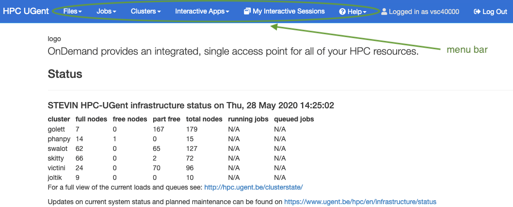

<!--

author:   name last_name
email:    training@vib.de
version:  1.0.0
language: en
narrator: UK English Female

icon:     https://vib.be/sites/vib.sites.vib.be/files/logo_VIB_noTagline.svg

comment:  This document shall provide an entire compendium and course on the
          development of Open-courSes with [LiaScript](https://LiaScript.github.io).
          As the language and the systems grows, also this document will be updated.
          Feel free to fork or copy it, translations are very welcome...

script:   https://cdn.jsdelivr.net/chartist.js/latest/chartist.min.js
          https://felixhao28.github.io/JSCPP/dist/JSCPP.es5.min.js

link:     https://cdn.jsdelivr.net/chartist.js/latest/chartist.min.css
link:     https://cdnjs.cloudflare.com/ajax/libs/animate.css/4.1.1/animate.min.css
link:     https://raw.githubusercontent.com/vibbits/material-liascript/master/img/org.css
link:     https://cdnjs.cloudflare.com/ajax/libs/font-awesome/5.11.2/css/all.min.css
link:     https://fonts.googleapis.com/css2?family=Saira+Condensed:wght@300&display=swap
link:     https://fonts.googleapis.com/css2?family=Open+Sans&display=swap
link:     https://raw.githubusercontent.com/vibbits/material-liascript/master/vib-styles.css

tutor: Neuropixels
edition: 1st 

-->

# Installations

Please read this page carefully **before** the start of the workshop.

# 1. Set your VSC account

**a.** **Register** for an [HPC account](https://docs.vscentrum.be/access/vsc_account.html) before the course since it might take some time to process and activate. 

>
> P.s.: If you are from industry or in any other situation where you are not linked to an academic institution we can only help you get an account when registered in the VIB course, check avaiability in [VIB training website](https://training.vib.be/?tags%5B103%5D=103).
>

Once you have an account, you can [access it](https://account.vscentrum.be/), and you will be able to see your VSC ID, and other information about your account. Eventually you might want to add an SSH key to connect remotely. You will not need this for this session.

**b.** Test your account connection at UGent instance of VSC

Visit [login page](https://login.hpc.ugent.be) , the 1st time you do it permission will be requested to let the web portal access some of your personal information, authorize it!!  Once logged in, you should see this start page!

Once you are logged in, you should see this page:

All good, you can get started!